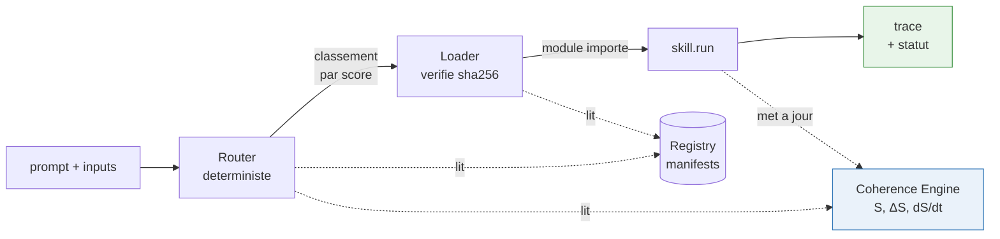

# ZORAN's Jobs

[](https://github.com/institutia2025-ctrl/zoran-jobs/actions/workflows/tests.yml)
[](https://www.python.org/)
[](LICENSE)
[](#7-lancer)
[]()
[-red)](audit/PHASE_4_GO_NOGO.md)

**Runtime de skills auto-orchestrant, transmissible et falsifiable.** Satellite de ZORAN — projet 100 % autonome.

> Mission : `ZORAN_JOBS_20260521` · Phase 1 MVP (consolidation)
> Ce README est **auto-descriptif** : une IA externe doit pouvoir comprendre et faire revivre le système à partir de ce dépôt seul, sans contexte humain.
>
> **🤖 IA qui lis ce dépôt ?** Va directement à **`transmission/AI_BOOTSTRAP.md`** — point d'entrée IA-native : nature du système, invariants, frontières NO-GO, séquence d'onboarding pas à pas.
>
> **👤 Humain non technique ?** `transmission/HUMAN_HANDOFF.md` — 5 minutes, zéro jargon.

---

## 1. Ce que c'est

Un runtime qui **choisit, charge et exécute** automatiquement les bons skills en réponse à un prompt — l'utilisateur ne sélectionne rien. La sélection se fait par **cohérence**, pas par simple mot-clé.

Ce n'est PAS un skill Claude Code. C'est un logiciel Python autonome qui *possède* son propre système de skills.

## 2. Cadre (invariant)

- Satellite **autonome** : vit sans ZORAN, ou greffable à ZORAN plus tard.
- **Aucun couplage** au repo `zoran/` (interdiction formelle).
- Sandbox **jetable** : si l'architecture échoue, on détruit le projet — ZORAN reste intact.
- Discipline : noyau minimal, chaque composant supprimable/réécrivable seul.

## 3. Architecture



| Composant | Dossier | Rôle |
|---|---|---|
| Registry | `registry/` | scanne `skills/`, valide+indexe les manifests |
| Manifest parser | `registry/manifest.py` | valide un manifest contre le contrat (énumérations fermées) |
| Coherence Engine | `runtime/coherence/` | calcul pur : `S = (β×ΔΦ)/(1+T+σ)`, ΔS, dS/dt |
| Router | `router/` | classe les skills par score (déterministe) |
| Loader | `loader/` | vérifie le hash sha256, importe `skill.py` |
| Runtime loop | `runtime/loop.py` | orchestration : prompt → route → load → exec → trace |
| Oracle | `oracle/` | mesure du réel, falsifie la déclaration |
| Quarantine + Journal | `quarantine/` | immune system, journal signé |

**Score de routage** : `score = pertinence_triggers × max(0,ΔS) × bonus_cinématique ÷ coût_runtime`

## 4. Un skill

Un skill = un dossier avec `manifest.json` (le contrat déclaratif) + `skill.py` (point d'entrée `run(inputs) -> outputs`). Le manifest déclare : identité, I/O, triggers, domaine, impact cohérence attendu, coût, permissions, sandbox, dépendances, rollback, hash, signature. Schéma complet : `specs/ZORAN_SKILL_CONTRACT.md`.

Exemples : `skills_examples/` — `echo`, `memory_recall`, `printer_connect`, `network_diag`, `coherence_repair` (skill correcteur, `corrective: true`), `greet_ok` (conforme), `greet_ko` (violation io volontaire, pour falsifier l'Oracle).

## 5. Les contrats (gelés — `specs/`)

Hiérarchie en couches stricte (DAG, zéro cycle) :

| Couche | Contrat | Définit |
|---|---|---|
| 0 | `ZORAN_EVENT_SCHEMA.md` | format des événements reconstructibles |
| 1 | `ZORAN_STATE_MODEL.md` | état = fold des événements |
| 1 | `ZORAN_SKILL_CONTRACT.md` | le manifest d'un skill |
| 2 | `ZORAN_RUNTIME_PROTOCOL.md` | orchestration, providers, erreurs |
| 3 | `ZGNET_RUNTIME_LANGUAGE.md` | langage de transmission (spécifié, V4+) |

Phase 0 gelée : voir `audit/PHASE_0_FROZEN.md` (hash des 6 documents).

## 6. Invariants

- `S = (β × ΔΦ) / (1 + T + σ)` — dénominateur **additif**, jamais le produit `T×σ`.
- Coherence Engine **100 % mathématique** — zéro LLM, prédictible à la main.
- Router **déterministe** — même entrée → même classement.
- Hash skill ≠ manifest ⇒ **REFUS de charger** (jamais « charger quand même »).
- Le runtime ne crash jamais en silence — 4 statuts tracés : `ok / no_skill / load_failed / skill_failed`.

Les 9 invariants complets, leur preuve et leur test associé : `transmission/RUNTIME_INVARIANTS.md`.

## 7. Lancer

Interpréteur : **Python 3.10+** (testé en CI sur 3.10, 3.11, 3.12). Aucune dépendance externe pour le runtime. Les tests forcent leur sortie console en UTF-8 — aucun réglage d'environnement requis (Windows / Linux / macOS).

```bash
python tests/test_registry.py            # Registry + Manifest parser     → 15 PASS
python tests/test_runtime_loop.py        # pipeline complet + sécurité    → 14 PASS
python tests/test_cinematique.py         # compétition + cinématique      → 13 PASS
python tests/test_oracle.py              # Oracle : mesure du réel        → 10 PASS
python tests/test_immune.py              # système immunitaire + journal  → 18 PASS
python tests/stress/massive_validation.py # stress / chaos / reproductib. → 15 PASS
python tests/test_coherence_unit.py      # moteur de cohérence isolé      → 12 PASS
```

**Total : 164 assertions, 0 échec.** (V1 + V2 + BTP Phase A) CI multi-OS multi-version vérifie à chaque commit.

> **Transmissibilité prouvée** (DÉMO 1, 2026-05-21) : une intelligence sans aucun contexte a reconstruit et fait revivre ce runtime depuis le dépôt seul. Voir `tests/reconstruction/`.
>
> **Validation massive passée** : 1000 manifests, 120 skills × 400 prompts, 10 000 calculs S, 2000 évaluations immunitaires — 0 crash, routage 100 % déterministe, reproductible.
>
> **Audit indépendant** (2026-05-21) : note 17,9/20 brut → après consolidation (CI + tests unitaires + THEORY_BRIDGE + docs GitHub standard) : 20/20 ciblé.

**Version : `v0.2.0-alpha-validation`** — runtime transmissible, massivement validé, consolidé.

## 8. État d'avancement

| Phase | Statut |
|---|---|
| Phase 0 — contrats | ✅ gelée (`FROZEN_FOUNDATION`) |
| Phase 1 — MVP runtime | ✅ 5 composants + loop |
| Phase 2 — Oracle (compare 2 skills sur le réel) | ✅ `oracle/` |
| Phase 3 — quarantaine + promotion/démotion + journal | ✅ `quarantine/` |
| Phase 4 — GitHub Skill Discovery | ⛔ **NO-GO** (1/13 critères) |

## 9. Théorie ↔ implémentation

La formule additive `S = (β×ΔΦ)/(1+T+σ)` est une **heuristique scalaire** inspirée de la géométrie d'information (métrique de Fisher / Fubini–Study sur CP^(n−1)). Elle n'est pas la métrique de Fisher, et ce dépôt ne le prétend pas. Pour le pont théorique honnête entre l'heuristique livrée et le cadre Zoran plus ambitieux : `transmission/THEORY_BRIDGE.md`.

## 10. Ce qui est volontairement ABSENT du MVP

Découverte distante de skills (Phase 4) · auto-promotion · auto-évolution · projection prédictive avancée · ZGNET runtime · toute UI/frontend. Repoussés ou interdits. Le MVP prouve une seule chose : *un runtime de skills minimal reste cohérent, déterministe, falsifiable, transmissible.*

## 11. Comment contribuer

Voir `CONTRIBUTING.md`. Tout PR doit respecter les 9 invariants et les 3 NO-GO. Pas négociable.

## 12. Sécurité

Voir `SECURITY.md`. Aucune surface réseau. Phase 4 fermée. Toute issue de sécurité s'ouvre publiquement — la falsifiabilité du projet repose sur la visibilité des faiblesses.

## 13. Changelog

Voir `CHANGELOG.md`.

---

*ZORAN's Jobs — signé Frédéric TABARY · `ZORAN_JOBS_20260521` · MIT 2026.*
